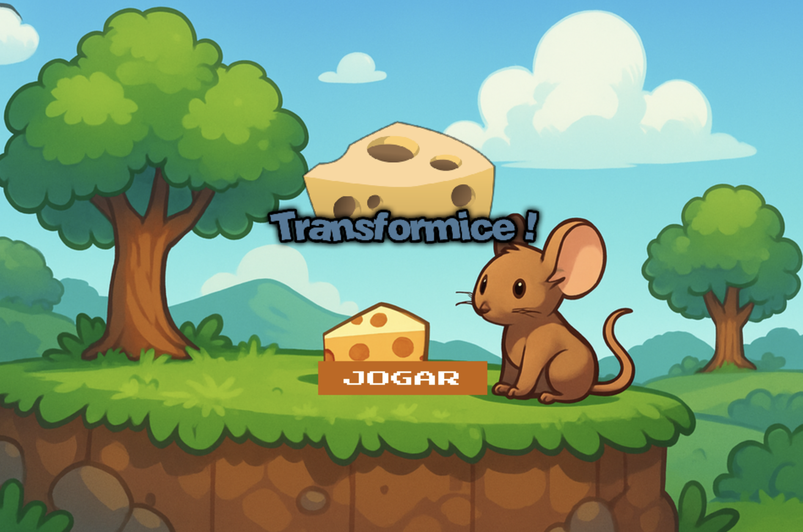
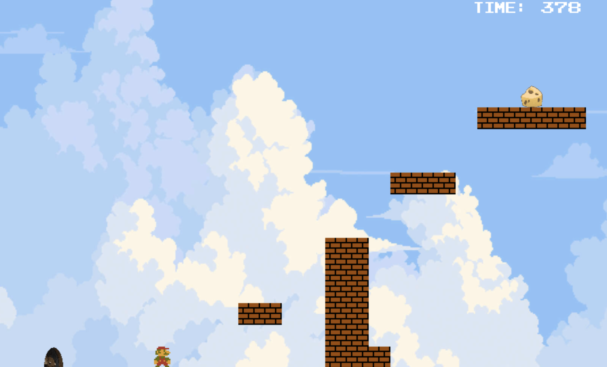
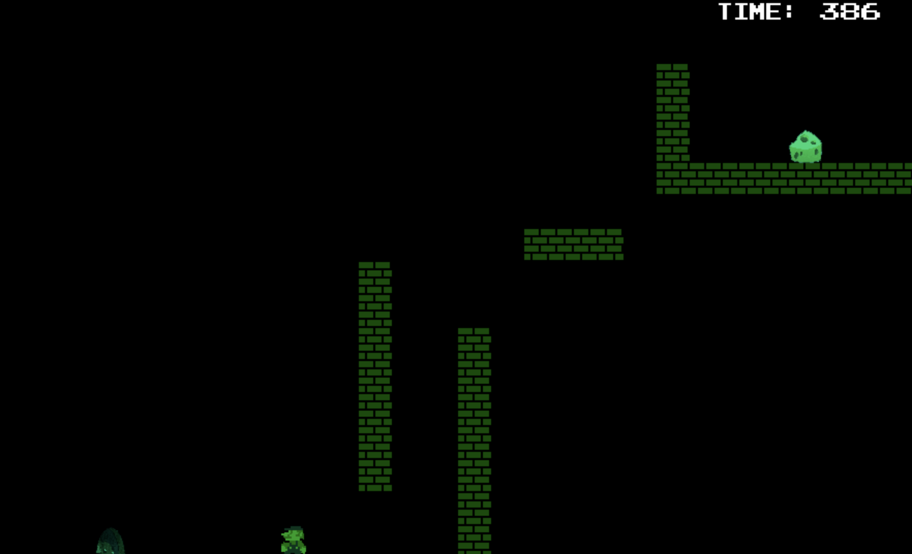

# CheeseRun

## 📸 Screenshots

(Adicione aqui as capturas de tela do jogo)

- **Menu:**

- **Fase 1:**

- **Fase 2:**

---

## 🐭 Título

**CheeseRun**

---

## 📝 Descrição

CheeseRun é um jogo de plataforma 2D single-player que homenageia o clássico jogo online Transformice. Desenvolvido em C++ com SDL2, o projeto busca resgatar a nostalgia e proporcionar uma experiência fluida e desafiadora para fãs do gênero.

O jogador controla um rato cujo objetivo é coletar um pedaço de queijo e levá-lo até a toca, superando obstáculos pelo caminho. Entre as mecânicas, destacam-se o pulo, a movimentação lateral e o icônico *Wall Jump*, que exige domínio técnico e coordenação precisa.

O jogo possui duas fases com dificuldade crescente. A cada fase, o jogador é desafiado com novos elementos como buracos, distâncias maiores e uso intensivo de mecânicas específicas. O tempo para completar a fase é limitado, e erros como não alcançar o objetivo a tempo reiniciam a fase.

---

## 🧪 Funcionalidades a serem testadas

Durante o playtesting, os jogadores devem prestar atenção especial às seguintes funcionalidades:

- Movimentação lateral e controle de pulos
- Detecção de colisão com queijo e toca
- Mecânica de *Wall Jump* (subida entre paredes)
- Redução de velocidade ao coletar o queijo
- Sons e efeitos visuais nos momentos-chave (ex: pegar o queijo, entrar na toca)

---

## 👥 Créditos

- **Carlos Magalhães Silva**
  Desenvolvimento geral, lógica de colisão, arte, documentação e efeitos sonoros.

- **Gabriel Jallais**
  Programação das mecânicas, implementação de fases, efeitos sonoros e design de níveis.
